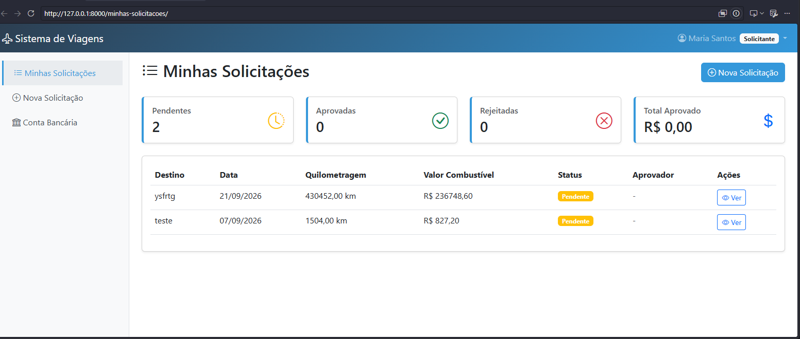

# Sistema de Controle de Viagens

[](https://github.com/LuisLopoFranco/Sistema-de-Controle-de-Viagens/actions/workflows/ci.yml)
[](https://www.djangoproject.com/)
[](https://www.python.org/)
[](LICENSE)

Sistema web para solicitação e aprovação de reembolso de despesas de viagem.
O colaborador registra a viagem com a nota fiscal, o sistema calcula o gasto
com combustível, e um aprovador decide.

<!-- SUBSTITUA pelo caminho real depois de tirar os prints -->


**[Ver demonstração ao vivo](https://SEU-APP.onrender.com)** ·
credenciais de teste no final desta página

---

## O que o sistema faz

**Solicitante** cadastra a conta bancária de reembolso, registra a viagem
(destino, data, quilometragem, valor do litro, consumo médio do veículo),
anexa a nota fiscal e acompanha o status.

**Aprovador** vê todas as solicitações com filtros por status, solicitante e
período, aprova ou rejeita com observações, e acessa um painel com totais e
ranking de gastos.

O valor do reembolso é calculado pelo sistema, não digitado:

```
(quilometragem / consumo médio) × valor do litro
```

O resultado é arredondado para dois decimais com `ROUND_HALF_UP` — o
arredondamento comercial. O padrão do Python é `ROUND_HALF_EVEN`, que
arredondaria R$ 0,125 para R$ 0,12: correto estatisticamente, estranho num
recibo.

---

## Decisões técnicas

Algumas escolhas do projeto que não são óbvias:

**Notas fiscais não são servidas como arquivo estático.** Elas passam por uma
view autenticada que verifica se o usuário é o dono da solicitação ou um
aprovador. Servir `MEDIA_ROOT` diretamente deixaria qualquer documento
acessível a quem descobrisse a URL — e nota fiscal contém dados pessoais. A
view devolve 404 em vez de 403 para quem não tem permissão, porque 403
confirmaria que a solicitação existe.

**O upload é validado pelo conteúdo, não pela extensão.** Extensão e
`Content-Type` são informados pelo cliente e podem ser forjados. O validador
lê os primeiros bytes do arquivo e confere a assinatura binária: um PDF de
verdade começa com `%PDF-`. Um `.txt` renomeado para `.pdf` é recusado.

**Os arquivos são gravados com nome UUID.** Nome vindo do usuário pode conter
caracteres problemáticos, e nome previsível permitiria adivinhar a URL de
documentos de terceiros.

**Nenhum segredo está no código.** `SECRET_KEY`, `DEBUG` e credenciais de
banco vêm de variáveis de ambiente. A `SECRET_KEY` não tem valor padrão de
propósito: a aplicação não sobe sem ela, o que impede uma chave de
desenvolvimento chegar a produção por descuido.

**As listagens usam `select_related` e paginação.** Sem isso, exibir o nome do
solicitante de cada linha dispararia uma consulta por registro. Há um teste
que fixa o teto de consultas da listagem — problema de performance não quebra
nada, só fica lento em silêncio conforme os dados crescem.

---

## Testes

65 testes cobrindo cálculo de reembolso, validação de upload, permissões por
perfil, fluxo de aprovação e paginação. Cobertura de 85%.

```bash
pytest
pytest --cov=travels --cov-report=term-missing
```

| Módulo | Cobertura |
|---|---|
| `permissions.py` | 100% |
| `signals.py` | 100% |
| `uploads.py` | 92% |
| `models.py` | 88% |
| `views.py` | 67% |

A cobertura de `views.py` é menor porque geração de PDF e telas de listagem
simples não têm teste dedicado. Foi decisão, não esquecimento: o esforço está
onde a falha custa caro — dinheiro, permissão e upload.

O CI roda a cada push e pull request: a suíte contra PostgreSQL (não SQLite),
verificação de migrações pendentes, `check --deploy` e build da imagem Docker.

---

## Stack

Django 5.2 LTS · Python 3.13 · PostgreSQL · Bootstrap 5 · Gunicorn ·
WhiteNoise · Docker · pytest · GitHub Actions

---

## Rodando localmente

Requisitos: Python 3.13.

```bash
git clone https://github.com/LuisLopoFranco/Sistema-de-Controle-de-Viagens.git
cd Sistema-de-Controle-de-Viagens

python -m venv venv
source venv/bin/activate          # Windows: venv\Scripts\Activate.ps1

pip install -r requirements.txt
```

Configure o ambiente:

```bash
cp .env.example .env
python -c "from django.core.management.utils import get_random_secret_key; print(get_random_secret_key())"
```

Cole a chave gerada em `SECRET_KEY` dentro do `.env`.

```bash
python manage.py migrate
python manage.py criar_usuarios_demo
python manage.py runserver
```

O comando `criar_usuarios_demo` gera senhas aleatórias e as exibe uma única
vez. Ele se recusa a rodar com `DEBUG=False`, para não criar contas
administrativas de demonstração num ambiente real.

Por padrão o banco é SQLite, para não exigir PostgreSQL instalado só para
experimentar o projeto.

### Com Docker

```bash
cp .env.example .env    # preencha SECRET_KEY e as variáveis POSTGRES_*
docker compose up --build
```

Sobe a aplicação com PostgreSQL, roda as migrações e o `collectstatic`.
Disponível em http://localhost:8000.

---

## Estrutura

```
travel_system/
    settings.py           configuração por variáveis de ambiente
    settings_test.py      ajustes específicos da suíte
travels/
    models.py             UserProfile, BankAccount, TravelRequest, SystemConfig
    views.py              telas e fluxo de aprovação
    permissions.py        decorator de restrição por perfil
    uploads.py            validação e nomeação de notas fiscais
    signals.py            criação automática de perfil
    management/commands/  criar_usuarios_demo
    tests/                65 testes
```

---

## Limitações conhecidas

Registradas de propósito, para não passar impressão de completude que o
sistema não tem:

- **Não valida data futura.** É possível registrar viagem que ainda não
  aconteceu. A regra depende de haver ou não adiantamento de despesa, decisão
  de negócio que não foi definida.
- **Não há teto de quilometragem.** Uma solicitação com valor atípico chega ao
  aprovador como qualquer outra.
- **CPF não tem validação de dígito verificador.**
- **Não há notificação por e-mail** quando uma solicitação muda de status.
- **A geração de PDF não tem teste automatizado.**

---

## Credenciais da demonstração

<!-- PREENCHA depois do deploy, com contas criadas só para o ambiente público -->

| Perfil | Usuário | Senha |
|---|---|---|
| Aprovador | `demo-aprovador` | *(definir no deploy)* |
| Solicitante | `demo-solicitante` | *(definir no deploy)* |

O ambiente de demonstração é reiniciado periodicamente e não contém dados
reais.

---

## Licença

MIT — veja [LICENSE](LICENSE).

## Autor

**Luis Gabriel Lopo** ·
[GitHub](https://github.com/LuisLopoFranco) ·
[LinkedIn](https://www.linkedin.com/in/luis-gabriel-lopo/)
